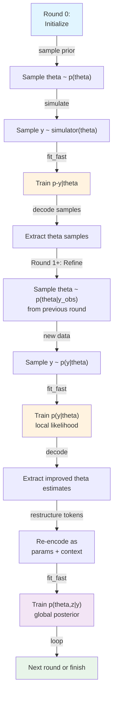

# Design Document: Bottom-Up Training Algorithm

## Overview

The bottom-up training algorithm implements a multi-round inference strategy that iteratively refines posterior approximations. It alternates between training local likelihood estimators `p(y|theta)` and global posterior estimators `p(theta, z|y)`, progressively improving inference quality. This design integrates with existing TFMPE infrastructure by reusing `fit_fast()` for each training round and leveraging the Tokens API for token restructuring between rounds.

## Steering Document Alignment

### Technical Standards (tech.md)
- **Type Annotations**: Full jaxtyping support with clear function signatures using `Array`, `PRNGKeyArray`, `Callable` types
- **Functions over Classes**: Bottom-up training implemented as a standalone function, not a class hierarchy
- **Code Quality**: Reuses existing `fit_fast()` and `cfm_loss()` rather than reimplementing; clear, testable logic with <80 char lines
- **JAX Integration**: Non-jittable wrapper around jittable `fit_fast()` calls; documents this limitation explicitly

### Project Structure (structure.md)
- **Location**: New function in `tfmpe/estimators/training.py` alongside `fit_fast()`
- **Tests**: E2E test in `test/test_estimators/test_e2e_training.py` in new test class
- **No new files**: Reuses existing infrastructure; only adds function to training.py

## Code Reuse Analysis

### Existing Components to Leverage
- **`fit_fast()`** (training.py:86-228): Core training loop using `nnx.scan` with batched CFM loss; called once per round
- **`cfm_loss()`** (training.py:35-83): Continuous Flow Matching loss computation; reused unchanged
- **`TFMPE` class** (tfmpe.py): Sampling and log probability methods; round 0 samples from prior, later rounds sample from posterior
- **`Tokens.from_pytree()`**: Creates token structures from PyTree dicts with labeller support
- **`Tokens.decode_keys()`**: Extracts only needed parameter keys without full reconstruction
- **`Labeller.for_keys()`**: Creates labeller instances for specified key sets
- **Test data generation** (test_e2e_training.py): `create_hierarchical_gaussian_data()` provides structured test data

### Integration Points
- **TFMPE API**: Uses `sample_posterior()` for parameter sampling, `log_prob_posterior_samples()` for log probability
- **Training loop**: Each round calls `fit_fast()` with appropriate token parameters and context
- **Token management**: Decodes samples from one round, re-encodes for next round's training objective
- **Test infrastructure**: Reuses existing E2E test patterns, assertions, and data creation

## Architecture



## Components and Interfaces

### Component 1: `fit_bottom_up()` Function

**Purpose**: Execute multi-round bottom-up training, alternating between local likelihood and global posterior estimators.

**Signature**:
```python
def fit_bottom_up(
    tfmpe: TFMPE,
    y_obs: Dict[str, Array],
    simulator_fn: Callable[[Dict[str, Array]], Dict[str, Array]],
    prior_fn: Callable[[PRNGKeyArray], Dict[str, Array]],
    n_rounds: int,
    n_samples_per_round: int,
    opt: nnx.Optimizer,
    n_iter_per_round: int,
    rng: PRNGKeyArray,
) -> Tuple[TFMPE, List[Tuple[Array, Array]]]:
    """
    Execute multi-round bottom-up training.

    Parameters
    ----------
    tfmpe : TFMPE
        Initial TFMPE instance for training
    y_obs : Dict[str, Array]
        Observed data, shape per key (*sample_shape, *event_shape, *batch_shape)
    simulator_fn : Callable
        Function that generates y ~ p(y|theta) given theta dict
    prior_fn : Callable
        Function that samples theta ~ p(theta) given PRNG key
    n_rounds : int
        Number of training rounds (≥1)
    n_samples_per_round : int
        Number of parameter samples to draw per round
    opt : nnx.Optimizer
        NNX optimizer for TFMPE training
    n_iter_per_round : int
        Iterations of fit_fast per training round
    rng : PRNGKeyArray
        PRNG key for sampling

    Returns
    -------
    Tuple[TFMPE, List[Tuple[Array, Array]]]
        (trained_tfmpe, all_round_losses) where all_round_losses is list of
        (train_losses, val_losses) tuples, one per round
    """
```

**Dependencies**:
- `fit_fast()` from training.py
- `TFMPE` class and its methods
- `Tokens.from_pytree()`, `Tokens.decode_keys()`
- `Labeller.for_keys()`
- JAX PRNG utilities, nnx

**Reuses**:
- `fit_fast()` for each training step
- Existing TFMPE sampling and log probability methods
- Tokens API for encode/decode

### Component 2: Round 0 Initialization Logic

**Purpose**: Generate initial training data by sampling from prior and simulator.

**Algorithm**:
1. Sample `n_samples` parameters from `prior_fn(rng)`
2. Simulate observations `y ~ simulator_fn(theta)` for each parameter sample
3. Create token structures for training `p(y|theta)`:
   - Context tokens: observations `y`
   - Parameter tokens: parameters `theta`
4. Call `fit_fast()` with these tokens

**Key Implementation Detail**: No validation set in round 0 (or use empty/single sample); only train loss tracking

### Component 3: Rounds 1+ Refinement Logic

**Purpose**: Iteratively refine posteriors by training local likelihood then global posterior.

**Algorithm per round**:
1. **Posterior Sampling**:
   - Sample `n_samples` parameter sets from previous round's posterior: `theta ~ p(theta|y_obs)`
   - Use TFMPE's `sample_posterior()` with observed context

2. **Local Likelihood Training**:
   - For each theta sample, simulate new observations: `y ~ simulator_fn(theta)`
   - Create tokens: context=y, params=theta
   - Call `fit_fast()` to train `p(y|theta)` on newly simulated data

3. **Global Posterior Training**:
   - Decode improved parameter estimates from local likelihood training
   - Re-encode tokens for global posterior objective:
     - Context: observed `y_obs` (fixed)
     - Params: theta + z (latent variables)
   - Call `fit_fast()` to train `p(theta, z | y_obs)`

4. **Loss Tracking**: Collect train/val losses from each `fit_fast()` call

**Key Implementation Detail**: Token restructuring handled by creating new Tokens objects with reordered keys; no manual data copying

## Data Models

### Input Structure
```
y_obs : Dict[str, Array]
    Observed context data with shape (*sample_shape, *event_shape, *batch_shape)

simulator_fn output : Dict[str, Array]
    Simulated observations matching y_obs structure and shapes

prior_fn output : Dict[str, Array]
    Parameter samples matching TFMPE's parameter expectations
```

### Token Structures

**Round 0 - Local Likelihood Tokens**:
```
context_tokens: Tokens
    - Keys: observation names from y_obs (e.g., 'y')
    - data: stacked simulated observations
    - slices: metadata for observation indices

param_tokens: Tokens
    - Keys: parameter names from prior_fn (e.g., 'theta', 'mu', 'sigma')
    - data: stacked parameter samples
    - slices: metadata for parameter indices
```

**Rounds 1+ - Global Posterior Tokens**:
```
context_tokens: Tokens
    - Keys: observation names (e.g., 'y') from y_obs
    - data: fixed observed context

param_tokens: Tokens
    - Keys: parameter + latent variable names (e.g., 'theta', 'z')
    - data: restructured to include latent encoding
    - Note: latent 'z' added via Tokens.from_pytree() with extended key set
```

### Return Value
```
Tuple[TFMPE, List[Tuple[Array, Array]]]
    - TFMPE: Trained estimator after all rounds
    - List of losses: Per-round (train_losses, val_losses) where each is Array shape (n_iter,)
```

## Error Handling

### Error Scenarios

1. **Invalid Round Count**
   - **Condition**: `n_rounds < 1`
   - **Handling**: Raise `ValueError("n_rounds must be ≥1")`
   - **User Impact**: Clear error message in test output

2. **Shape Mismatch Between Rounds**
   - **Condition**: Parameter shapes change between simulator and prior_fn outputs
   - **Handling**: Let `Tokens.from_pytree()` raise with clear error about shape mismatch
   - **User Impact**: Identifies simulator/prior inconsistency early

3. **NaN/Inf in Losses**
   - **Condition**: `fit_fast()` returns non-finite losses (divergence)
   - **Handling**: Propagate to E2E test assertions; test will fail with clear message
   - **User Impact**: Test catches training instability; test output shows which round failed

4. **Missing Keys in Token Decoding**
   - **Condition**: `decode_keys()` called with keys not in token structure
   - **Handling**: Let `decode_keys()` raise `KeyError` with list of valid keys
   - **User Impact**: Development-time error; helps catch algorithm logic bugs

## Testing Strategy

### Unit Testing
- **Not planned**: `fit_bottom_up()` is integration-level; no separate unit tests
- **Rationale**: Logic is straightforward sequencing of tested components (`fit_fast()`, TFMPE methods)

### Integration Testing
- **E2E Test Class**: `TestE2ETrainingBottomUp` in `test_e2e_training.py`
- **Test Data**: Reuse `create_hierarchical_gaussian_data()` with 2-3 rounds
- **Assertions**:
  - All losses are finite across all rounds
  - Train loss doesn't catastrophically diverge (no huge spikes)
  - Returned TFMPE is valid (can call `sample_posterior()`)
  - Loss shape is correct for each round: `(n_iter,)` per round

### End-to-End Testing
- **Scenario 1**: Single round (n_rounds=1) matches behavior of direct `fit_fast()` call
- **Scenario 2**: Multi-round training (n_rounds=3) completes without divergence
- **Scenario 3**: Loss shapes and finite-value checks work for all rounds

## Implementation Notes

1. **Non-Jittable**: `fit_bottom_up()` uses Python loops for rounds; each `fit_fast()` call is jitted internally
2. **Token Restructuring**: New Tokens objects created via `from_pytree()` for each round; no manual slicing/indexing
3. **PRNG Management**: Split RNG key for each round and `fit_fast()` call (standard JAX pattern)
4. **Validation Data**: For simplicity, first implementation uses empty validation set or reuses training data; refinement in future
