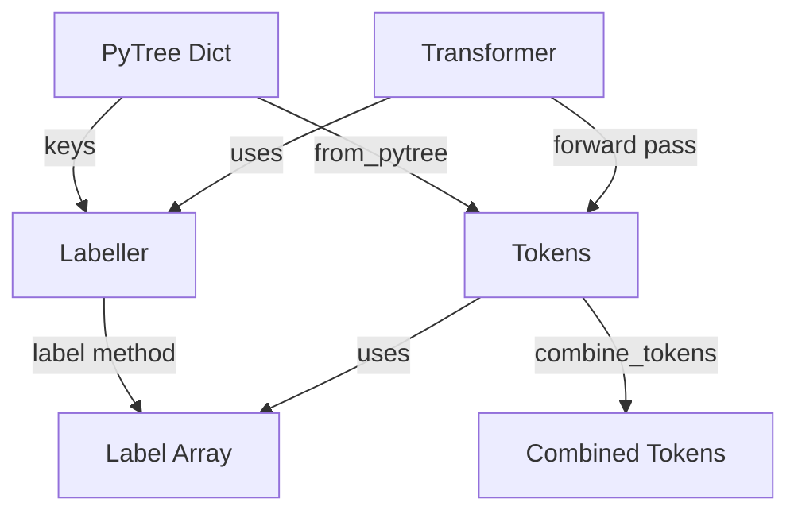

# Design Document: Labeller Refactoring

## Overview

This design introduces a new `Labeller` type that decouples label generation logic from the `Tokens` class. Currently, `Tokens` stores `label_map` (key → integer mapping) and `key_order` (ordered key list) to handle label array generation. With this refactoring, `Labeller` will store only `label_map` (more DRY, no key duplication), while `Tokens` removes both fields since key order can be derived from `slices` dictionary ordering via a `key_order` property.

The refactoring also relaxes the constraint in `combine_tokens()` that previously required identical `key_order` across both input tokens, enabling more flexible token combination workflows.

## Steering Document Alignment

### Technical Standards (tech.md)
- **Functions over Classes**: `Labeller` is a dataclass (function-like composition) not a class with inheritance
- **Type Annotations**: Full jaxtyping support with `Array` type for label outputs
- **JAX Integration**: Maintains JAX PyTree registration if needed for gradient tracking
- **Testing**: pytest-based unit testing with clear test naming

### Project Structure (structure.md)
- **Location**: `Labeller` defined in `tfmpe/preprocessing/utils.py` alongside `Independence` and `SliceInfo`
- **Import Pattern**: Named imports at top of file, following project conventions
- **Test Location**: Unit tests in `test/test_preprocessing/test_labeller.py` (new file)

## Code Reuse Analysis

### Existing Components to Leverage
- **SliceInfo NamedTuple**: Already used in `Tokens` to describe token metadata (offset, event_shape, batch_shape)
- **Existing label generation logic**: Current `Tokens.from_pytree()` implementation shows label array creation pattern that `Labeller.label()` will replicate
- **Independence type**: Already decouples independence logic from Tokens; `Labeller` follows same pattern for labels
- **JAX utilities**: Use `jnp.full()`, `jnp.concatenate()`, `jnp.broadcast_to()` for label array construction

### Integration Points
- **Tokens class**: Remove `label_map` field, modify `from_pytree()` to accept `Labeller` instance
- **combine_tokens()**: Refactor to work with different key_order by computing union of keys
- **Transformer embedding**: Use `Labeller` instance to generate labels instead of extracting from `Tokens`
- **Tests**: Update fixtures and test code that previously relied on `select_tokens()`

## Architecture



## Components and Interfaces

### Component 1: Labeller Type

- **Purpose**: Store global label mappings for a set of keys; provide label array generation across token instances
- **Location**: `tfmpe/preprocessing/utils.py`
- **Interfaces**:
  - `__init__(label_map: Dict[str, int])` - Initialize with key-to-label mapping
  - `.label_map` field - Returns `Dict[str, int]` mapping key names to indices
  - `.label(slices: Dict[str, SliceInfo]) -> Array` - Generate label array (no broadcasting needed)

- **Dependencies**:
  - `SliceInfo` from same module
  - `jax.numpy` for array operations
  - `jaxtyping.Array` for type annotations

- **Reuses**:
  - Label generation pattern from `Tokens.from_pytree()` (lines 129-155 in tokens.py)
  - `SliceInfo` structure already defined in utils.py

### Component 2: Tokens Class (Modified)

- **Purpose**: Container for structured token data (unchanged conceptually, only field removal)
- **Removals**:
  - Remove `label_map: Dict[str, int]` field (lines 62-63 in tokens.py)
  - Remove `key_order: List[str]` field (lines 49-50 in tokens.py)
  - Remove `label_map` construction from `from_pytree()` (line 129)
  - Remove `key_order` construction from `from_pytree()` (line 126)
  - Remove `label_map` and `key_order` from `with_values()` return (lines 442-443)
  - Remove `label_map` and `key_order` from PyTree aux_data (lines 467-468)

- **Additions**:
  - Add `key_order` property that derives ordering from `slices.keys()` in slice offset order
  - Update docstring to document new property

- **Retained**:
  - `slices: Dict[str, SliceInfo]` - contains all information needed to derive key order
  - All other fields and methods unchanged

- **Breaking Changes**:
  - `select_tokens()` method removed entirely (lines 239-365)
  - Code accessing `.key_order` must work with it as a computed property (same interface, different backing)
  - Tests that assert on `label_map` will need updates
  - Code creating `Tokens` directly must no longer pass `label_map` or `key_order`

### Component 3: combine_tokens() Function (Refactored)

- **Purpose**: Combine multiple Tokens with flexible key handling
- **Location**: `tfmpe/preprocessing/combine.py`
- **Current Constraint**: Line 47-51 requires `tokens1.key_order == tokens2.key_order`

- **New Behavior**:
  - Remove key_order equality check
  - Compute union of all keys from both tokens
  - For each key:
    - If in both tokens: use max event_shape (current behavior)
    - If in one token: use that token's slice info
  - Stretch labels as necessary to match padded token dimensions
  - Ensure padding mask correctly handles all keys

- **Implementation Details**:
  - Build set of all keys from both tokens
  - Iterate over union (maintaining consistent ordering)
  - Handle slices gracefully when key missing in one token

## Data Models

### Labeller
```python
@dataclass
class Labeller:
    """Global label information for a set of keys."""

    label_map: Dict[str, int]  # Mapping from key names to integer label indices

    def label(
        self,
        slices: Dict[str, SliceInfo]
    ) -> Array:
        """
        Generate label array for given token configuration.

        Parameters
        ----------
        slices : Dict[str, SliceInfo]
            Token metadata mapping with keys in offset order

        Returns
        -------
        Array
            Label array with shape (n_total_tokens,)
        """
        # Build labels from slices using label_map
        # Concatenate per-key label arrays in slice offset order
```

## Error Handling

### Error Scenarios

1. **Labeller with empty label_map**
   - **Handling**: Raise ValueError("Labeller requires at least one key mapping")
   - **User Impact**: Caught during Labeller initialization, clear error message

2. **label() called with keys not in label_map**
   - **Handling**: Raise KeyError with informative message about missing key
   - **User Impact**: Clear error on label generation if key in slices not in label_map

3. **combine_tokens() with incompatible slices**
   - **Handling**: Keep existing validation (independence, functional_inputs)
   - **User Impact**: Existing error handling unchanged


## Testing Strategy

### Unit Testing (Labeller)

**File**: `test/test_preprocessing/test_labeller.py`

Test cases:
- `test_labeller_init_with_label_map` - Verify Labeller initialization
- `test_labeller_label_single_key` - Label generation with one key
- `test_labeller_label_multi_key` - Label generation with multiple keys
- `test_labeller_label_with_different_event_shapes` - Various token shapes
- `test_labeller_label_correct_indices` - Verify correct label indices per key
- `test_labeller_label_correct_shapes` - Verify output shape matches total tokens
- `test_labeller_label_consistency` - Same input → same output
- `test_labeller_empty_map_raises` - Error handling for empty label_map
- `test_labeller_missing_key_raises` - Error handling for key not in label_map

### Integration Testing

**Updates to**: `test/test_preprocessing/test_tokens_dynamic.py`

Changes:
- Replace `select_tokens()` tests with tests that create Tokens directly or use alternative filtering
- Update tests asserting `key_order` and `label_map` values
- Add tests for Labeller-aware label generation
- Ensure labels still match token structure

**Updates to**: `test/test_nn/test_transformer/test_transformer.py`

Changes:
- Update fixtures that used `select_tokens()`
- Verify transformer still works with Labeller-generated labels
- Test combining tokens in transformer workflows

**Updates to**: Combine function tests (new test file or additions)

Changes:
- Add tests for `combine_tokens()` with different key_order
- Verify label generation with union of keys
- Test padding mask correctness with different keys

## Migration Path

1. **Phase 1**: Create `Labeller` type, add unit tests (no breaking changes yet)
2. **Phase 2**: Update `Tokens` to use `Labeller`, remove `label_map`
3. **Phase 3**: Remove `select_tokens()` method
4. **Phase 4**: Refactor `combine_tokens()` for flexible key handling
5. **Phase 5**: Update all integration tests and verify everything works

This phased approach allows validation at each step before proceeding to breaking changes.
