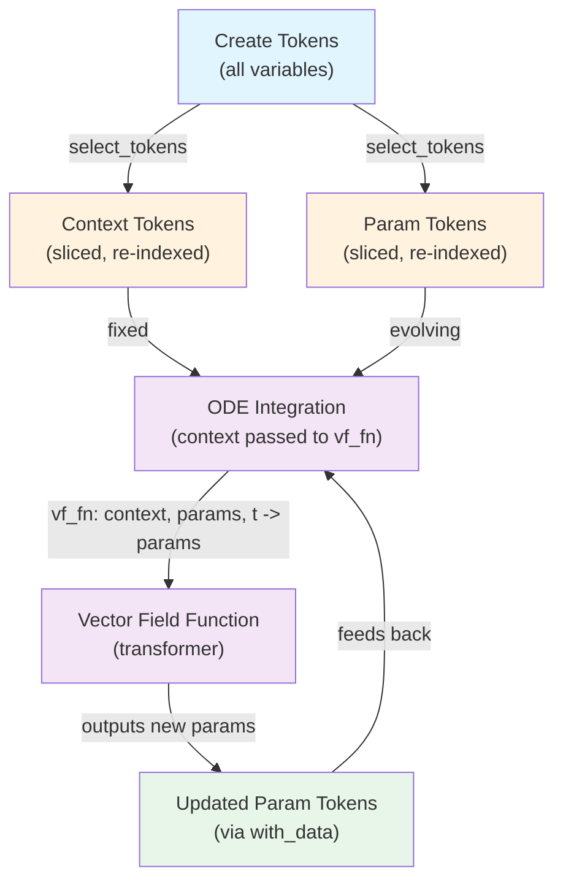

# Design Document: Remove TokenView and Enhance Token Updates

## Overview

This refactoring consolidates the token abstraction layer by removing the `TokenView` class and enhancing the `Tokens` class with:
1. A `select_tokens()` method that returns sliced `Tokens` instead of `TokenView`
2. A `with_data()` method for full data vector replacement
3. Simplified type signatures throughout the codebase

The design supports the core flow: instantiate all `Tokens`, select subsets (context/params), update params via `with_data()` during ODE integration.

## Steering Document Alignment

### Technical Standards (tech.md)
- **Type Annotations**: Eliminate `Union[Tokens, TokenView]` everywhere, using only `Tokens`
- **Functions over Classes**: Leverage dataclass structure; no new class hierarchy
- **Code Quality**: Removal of defensive type-checking improves maintainability and enables true duck typing

### Project Structure (structure.md)
- **Preprocessing module**: Consolidates to single token abstraction
- **Modified files**: `tfmpe/preprocessing/tokens.py` (core changes)
- **Removed files**: `tfmpe/preprocessing/token_view.py`
- **Updated files**: `tfmpe/nn/transformer/embedding.py`, `tfmpe/nn/transformer/transformer.py`, `tfmpe/estimators/ode.py`

## Code Reuse Analysis

### Existing Components to Leverage
- **`update_flat_array()`** (flatten.py): Already flattens and inserts data at key offsets; used by `with_values()`, reuse for `with_data()`
- **`SliceInfo` metadata**: Unchanged structure; used for all slicing operations and re-indexing
- **`build_self_attention_mask()` / `build_cross_attention_mask()`** (masks.py): Existing mask builders work with re-indexed slices
- **`decode_pytree()` / `decode_pytree_keys()`** (reconstruct.py): Reconstruction logic unchanged
- **`flatten_pytree()`** (flatten.py): Used for initial token creation; logic reused for sliced tokens

### Integration Points
- **Transformer Embedding** (`embedding.py`): Remove `TokenView` import; update type hints from `Union[Tokens, TokenView]` to `Tokens`
- **Transformer** (`transformer.py`): Update `encode()`, `decode()`, `forward()` signatures; `cross_attention_mask()` method exists on `Tokens`
- **ODE Solvers** (`estimators/ode.py`): Update signatures to accept context and params; vector field now `Callable[[Tokens, Tokens, Scalar], Tokens]`

## Architecture



## Components and Interfaces

### Tokens Class Enhancements

#### `select_tokens(keys: List[str]) -> Tokens`
- **Purpose**: Create a sliced view of tokens containing only specified keys (replaces `TokenView`)
- **Implementation**:
  1. Validate all keys exist in `self.key_order`
  2. Compute token indices for selected keys from slice metadata
  3. Extract data slice using advanced indexing: `self.data[..., indices, :]`
  4. Extract label slice: `self.labels[..., indices]`
  5. Extract padding mask slice (if present): `self.padding_mask[..., indices]`
  6. Extract functional inputs slice (if present): `self.functional_inputs[..., indices, :]`
  7. Extract self-attention mask submatrix: `self.self_attention_mask[ix_(indices, indices)]`
  8. **Re-index slices**: Compute new slice offsets starting from 0
  9. Return new `Tokens` with sliced data and re-indexed metadata
- **Key Invariant**: Returned `Tokens` has offsets starting at 0, enabling seamless downstream use
- **Dependencies**: Uses `SliceInfo` logic, `jnp.ix_()` for mask extraction

#### `with_data(new_data: Array) -> Tokens`
- **Purpose**: Create new `Tokens` with entirely replaced data vector (used in ODE integration)
- **Signature**: `def with_data(self, new_data: Array) -> 'Tokens'`
- **Implementation**:
  1. Validate `new_data.shape == self.data.shape`
  2. Return new `Tokens` object with:
     - `data=new_data`
     - All other fields unchanged (labels, masks, slices, metadata)
- **Usage Pattern**: `param_tokens = param_tokens.with_data(vf_fn(param_tokens, t).data)`
- **Dependencies**: None (simple replacement)
- **Error Handling**: Raise `ValueError` if shape mismatch with helpful message

### Remove TokenView Class
- **File Deletion**: Delete `tfmpe/preprocessing/token_view.py` entirely
- **Cleanup**: Remove all imports of `TokenView` from:
  - `tfmpe/preprocessing/__init__.py` (if exported)
  - `tfmpe/nn/transformer/embedding.py`
  - `tfmpe/nn/transformer/transformer.py`

### Update Transformer Integration

#### Embedding (`embedding.py`)
- **Current**: `def __call__(self, tokens: Union[Tokens, TokenView], ...):`
- **New**: `def __call__(self, tokens: Tokens, ...):`
- **Change**: Remove `TokenView` from union type; logic unchanged (both had same `.data`, `.labels`, `.functional_inputs`)

#### Transformer (`transformer.py`)
- **Remove import**: `from ...preprocessing.token_view import TokenView`
- **Update `encode()` signature**:
  - Current: `tokens: Union[Tokens, TokenView]`
  - New: `tokens: Tokens`
- **Update `decode()` signature**:
  - Current: `tokens: Union[Tokens, TokenView]`
  - New: `tokens: Tokens`
- **Update `forward()` signature**:
  - Current: `context: TokenView, params: TokenView`
  - New: `context: Tokens, params: Tokens`
- **No logic changes**: `tokens.self_attention_mask` and `cross_attention_mask()` method work identically

### Update ODE Solver Signatures

#### Current Signatures (ode.py)
```python
def solve_forward_ode(
    vf_fn: Callable[[Array, Scalar], Array],  # (x, t) -> array
    x0: Array,
    ...
) -> Array
```

#### New Signatures (ode.py)
```python
def solve_forward_ode(
    vf_fn: Callable[[Tokens, Tokens, Scalar], Tokens],  # (context, params, t) -> params
    context: Tokens,
    params: Tokens,
    ...
) -> Tokens
```

**Changes apply to**:
- `solve_forward_ode()`
- `solve_backward_ode()`
- `solve_augmented_ode()`
- `batch_solve_forward_ode()`
- `batch_solve_augmented_ode()`

**Implementation Details**:
- Vector field function now accepts:
  - `context: Tokens` - Fixed context tokens (e.g., observations)
  - `params: Tokens` - Parameter tokens being evolved
  - `t: Scalar` - Time value
  - Returns: Updated `params` as `Tokens`
- Inner `ode_func()` receives augmented state and calls `vf_fn(context, y_params, t)`
- diffrax integration: `y0` is `params` (a `Tokens` object), JAX pytree registration handles this
- Return values become `Tokens` objects directly
- Context remains fixed throughout ODE integration (passed to vf_fn at each step)

## Data Models

### Tokens Structure (Unchanged)
```
Tokens:
  data: Array                      # shape (*sample, n_tokens, max_batch)
  labels: Array                    # shape (*sample, n_tokens)
  self_attention_mask: Array       # shape (n_tokens, n_tokens)
  padding_mask: Optional[Array]    # shape (*sample, n_tokens)
  functional_inputs: Optional[Array] # shape (*sample, n_tokens, max_batch)
  slices: Dict[str, SliceInfo]     # token metadata per key
  label_map: Dict[str, int]        # key -> label integer mapping
  key_order: List[str]             # ordered key names
  independence: Optional[Independence]  # attention rules
```

### SliceInfo (Unchanged)
```
SliceInfo:
  offset: int                      # position in flattened token array
  event_shape: Tuple[int, ...]     # shape of token events
  batch_shape: Tuple[int, ...]     # shape in batch dimension
```

## Error Handling

### Error Scenarios

1. **Invalid Key Selection in `select_tokens()`**
   - **Scenario**: Key not in `self.key_order`
   - **Handling**: Raise `KeyError("Key '{key}' not found. Available: {self.key_order}")`
   - **User Impact**: Clear guidance on available keys

2. **Shape Mismatch in `with_data()`**
   - **Scenario**: `new_data.shape != self.data.shape`
   - **Handling**: Raise `ValueError(f"Shape mismatch: expected {self.data.shape}, got {new_data.shape}")`
   - **User Impact**: Prevents silent corruption; clear expected vs actual

3. **Empty Key Selection**
   - **Scenario**: `select_tokens([])` called with empty list
   - **Handling**: Raise `ValueError("Cannot select empty key list")`
   - **User Impact**: Prevents creation of degenerate tokens

4. **ODE Vector Field Type Mismatch**
   - **Scenario**: Vector field returns `Array` instead of `Tokens`
   - **Handling**: JAX pytree error at diffrax integration; caught early
   - **User Impact**: Type system guides correct implementation

## Testing Strategy

### Unit Testing

**Tokens Slicing (repurposed TokenView tests)**
- `test_select_tokens_returns_tokens`: Verify returns `Tokens` class, not `TokenView`
- `test_select_tokens_subset_data`: Data extraction with correct indices
- `test_select_tokens_subset_labels`: Label extraction correctness
- `test_select_tokens_subset_padding_mask`: Padding mask slicing
- `test_select_tokens_subset_functional_inputs`: Functional inputs slicing
- `test_select_tokens_self_attention_mask`: Correct submatrix extraction via `ix_`
- `test_select_tokens_slices_reindexed`: Verify offsets re-indexed to 0
- `test_select_tokens_cross_attention_mask`: Cross-attention computation with re-indexed slices
- `test_select_tokens_single_key`: Single-key selection
- `test_select_tokens_invalid_key_raises`: Error on invalid key
- `test_select_tokens_empty_raises`: Error on empty selection

**Tokens Direct Updates**
- `test_with_data_full_replacement`: Complete data replacement
- `test_with_data_preserves_metadata`: Verify labels, masks, slices unchanged
- `test_with_data_preserves_independence`: Independence spec unchanged
- `test_with_data_shape_validation`: Shape mismatch raises `ValueError`
- `test_with_data_sample_dims`: Works with sample dimensions
- `test_with_data_roundtrip`: Update and retrieve via decode

**Backward Compatibility**
- `test_with_values_still_works`: Keep `with_values()` working during transition (can be deprecated later)

### Integration Testing
- `test_transformer_encode_with_sliced_tokens`: Embedding/encoder works with sliced `Tokens`
- `test_transformer_decode_with_sliced_tokens`: Decoder works with cross-attention on sliced `Tokens`
- `test_ode_solver_tokens_vector_field`: ODE solver accepts `Tokens` vector field
- `test_select_decode_consistency`: `select_tokens().decode()` matches original behavior

### End-to-End Testing
- `test_training_loop_with_sliced_tokens`: Full forward pass (encode context, decode params with cross-attention)
- `test_ode_integration_with_tokens`: Forward/backward ODE integration using `Tokens` vector fields

### Test Consolidation Strategy
- **No new test classes**: All testing happens in `test_tokens_basic.py` and `test_tokens_dynamic.py`
- **TokenView tests → Tokens tests**: Directly modify existing `TokenView` test functions to test `select_tokens()` on `Tokens`
- **No duplication**: If `test_select_tokens_subset_data` already exists, modify it rather than create a duplicate
- **Remove redundancy**: Tests for properties that work identically on both classes should verify once (on `Tokens`)

## Implementation Notes

### JAX Pytree Registration
`Tokens` is already registered with `@register_pytree_node_class`. The `tree_flatten()` and `tree_unflatten()` methods handle:
- **Children** (arrays with sample dimension): `data`, `labels`, `padding_mask`, `functional_inputs`
- **Aux data** (static metadata): `self_attention_mask`, `slices`, `label_map`, `key_order`, `independence`

This ensures diffrax can work with `Tokens` directly in ODE solvers.

### Re-indexing in `select_tokens()`
When creating sliced tokens, compute new slice offsets:
```python
reindexed = {}
current_offset = 0
for key in selected_keys:
    slice_info = self.slices[key]
    n_tokens = 1
    for dim in slice_info.event_shape:
        n_tokens *= dim
    reindexed[key] = slice_info._replace(offset=current_offset)
    current_offset += n_tokens
```

This pattern is already in `TokenView._compute_slices()` and will be moved to `Tokens.select_tokens()`.

